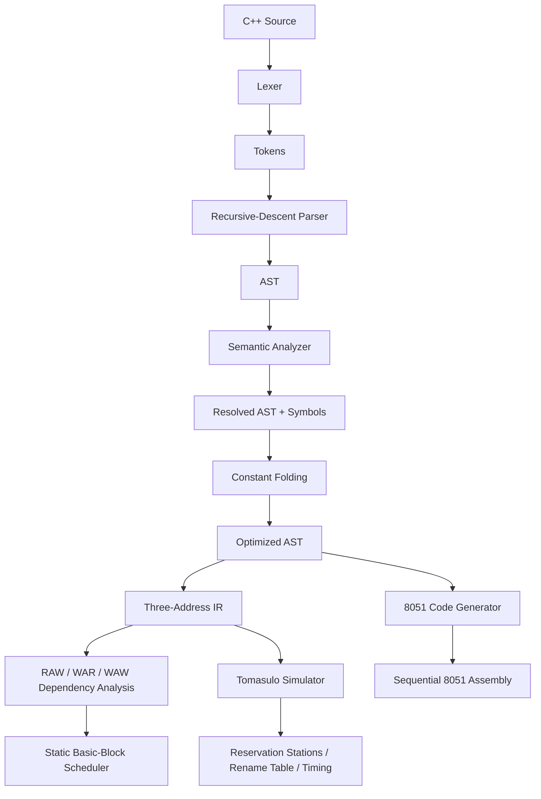

# C++51 Compiler + Tomasulo Lab

A browser-based educational compiler that translates a **documented 8-bit subset of C++** into **Intel 8051 assembly** and exposes a second, architecture-focused path for **three-address IR, dependency analysis, static scheduling, and Tomasulo simulation**.

> **Accuracy note:** a classic Intel 8051 does not implement Tomasulo's algorithm or out-of-order execution. Tomasulo is simulated over the compiler's logical IR as an educational analysis layer. Final 8051 assembly is still sequential.

## Resume description

> Built a modular compiler for an 8-bit C++ subset targeting Intel 8051 assembly, implementing lexical analysis, recursive-descent parsing, AST construction, semantic analysis, constant folding, three-address IR generation, RAW/WAR/WAW dependency analysis, dependency-aware static scheduling, a cycle-accurate educational Tomasulo reservation-station simulator, and automated regression tests.

A shorter version:

> Developed a C++-subset → Intel 8051 compiler with AST/IR optimization, scoped symbol resolution, dependency analysis, Tomasulo out-of-order scheduling simulation, and an interactive browser-based compiler visualizer.

## Architecture



The two paths after optimization serve different purposes:

- **Real backend:** optimized AST → valid sequential Intel 8051 assembly.
- **Architecture lab:** optimized AST → IR → dependencies → static schedule + Tomasulo simulation.

The distinction is deliberate. It lets the project demonstrate real compiler construction and out-of-order scheduling without falsely claiming that 8051 hardware can execute instructions out of order.

## Project structure

```text
cpp51-compiler/
├── index.html
├── styles.css
├── package.json
├── README.md
├── docs/
│   └── TOMASULO.md
├── examples/
│   ├── arithmetic.cpp
│   ├── control-flow.cpp
│   ├── demo.cpp
│   └── tomasulo.cpp
├── src/
│   ├── compiler.js
│   ├── errors.js
│   ├── lexer.js
│   ├── parser.js
│   ├── semantic.js
│   ├── optimizer.js
│   ├── codegen.js
│   ├── ui.js
│   ├── ir/
│   │   ├── ir.js
│   │   └── ir-generator.js
│   ├── scheduler/
│   │   └── instruction-scheduler.js
│   └── tomasulo/
│       ├── dependency-analyzer.js
│       └── simulator.js
└── tests/
    ├── compiler.test.js
    └── tomasulo.test.js
```

## Compiler pipeline

### 1. Lexical analysis

`src/lexer.js`

The lexer turns characters into tokens and records line/column information.

Example:

```cpp
uint8_t x = 5;
```

becomes conceptually:

```text
uint8_t  IDENTIFIER(x)  =  NUMBER(5)  ;
```

### 2. Parsing

`src/parser.js`

A recursive-descent parser turns tokens into an Abstract Syntax Tree.

Operator precedence is represented by the parser call hierarchy:

```text
||
&&
|
^
&
== !=
< <= > >=
<< >>
+ -
* / %
unary
primary
```

Therefore:

```cpp
2 + 3 * 4
```

is parsed as:

```text
2 + (3 * 4)
```

### 3. Semantic analysis

`src/semantic.js`

This phase performs checks that grammar alone cannot answer:

- variable declared before use
- duplicate declaration in one scope
- block-scope shadowing
- legal `break` / `continue`
- hardware ports `P0`-`P3`
- 8051 internal-RAM allocation

Variables are allocated from `30H` through `6FH`.

### 4. Constant folding

`src/optimizer.js`

Literal-only expressions are evaluated during compilation.

```cpp
uint8_t x = 2 + 3 * 4;
```

becomes effectively:

```cpp
uint8_t x = 14;
```

### 5. Three-address IR

`src/ir/ir-generator.js`

The IR makes dependencies explicit.

Source:

```cpp
uint8_t c = a + b;
```

IR:

```text
ADD t0, a, b
MOV c, t0
```

Complex nested expressions are decomposed into small operations with virtual temporaries such as `t0`, `t1`, and `t2`.

Short-circuit `&&` and `||` are represented with branches and labels, so the IR preserves source semantics.

### 6. Dependency analysis

`src/tomasulo/dependency-analyzer.js`

For each basic block, the compiler computes:

- **RAW — Read After Write:** true data dependency
- **WAR — Write After Read:** name dependency
- **WAW — Write After Write:** name dependency

Example:

```text
I0: MOV a, 2
I1: MOV b, 3
I2: ADD t0, a, b
```

contains:

```text
I0 -> I2 : RAW(a)
I1 -> I2 : RAW(b)
```

`I2` cannot execute until both input values exist.

## Static scheduling

`src/scheduler/instruction-scheduler.js`

This is a **compile-time** scheduler inspired by the same dependency concepts used by Tomasulo.

It performs list scheduling inside a basic block and may prioritize long-latency independent work.

Example source ordering:

```text
ADD ...
MUL ...
```

may become:

```text
MUL ...
ADD ...
```

when both are ready and independent.

The scheduler **never crosses**:

- labels
- conditional branches
- unconditional jumps
- returns
- `P0`-`P3` writes

The current static schedule is shown for analysis. The production 8051 backend still uses the optimized AST because the 8051 accumulator architecture requires target-specific register/stack decisions.

## Tomasulo simulator

`src/tomasulo/simulator.js`

The simulator models a hypothetical machine containing:

```text
2 Load stations
3 Add/logic stations
2 Multiply stations
2 Divide stations
```

Educational operation latencies:

| Operation class | Simulated latency |
| --- | ---: |
| move / add / logic / compare | 1 |
| shift | 2 |
| multiply | 4 |
| divide / modulo | 6 |

These are **simulator parameters**, not claims about official 8051 timing.

### Reservation station fields

Each station tracks:

```text
name
busy
operation
instruction
Vj / Vk
Qj / Qk
destination
remaining cycles
```

Interpretation:

- `Vj`, `Vk`: operand is ready
- `Qj`, `Qk`: operand is waiting for another station tag
- `destination`: logical value produced by this station

### Register-status table

The register-status table maps a logical destination to its latest producer:

```text
t0      Add1
t1      Mul1
V_X_0   Load2
```

Updating this table at issue time is the simulator's **register-renaming step**.

### Common Data Bus

Only one completed station writes a result per cycle.

When a tag writes back:

1. waiting reservation stations compare `Qj/Qk` with that tag
2. matching operands become ready
3. the architectural rename entry is cleared only if that station is still the newest producer
4. the station becomes free

That last rule is important for WAW-safe renaming.

## Why simulation is per basic block

At compile time the compiler generally does not know:

- which branch condition will be true at runtime
- how many iterations a loop will execute
- what values hardware ports will contain

Therefore the Tomasulo visualizer analyzes straight-line **basic blocks** independently.

This is more technically honest than pretending the compiler knows one complete dynamic execution trace.

Values entering a block from elsewhere are considered ready live-ins.

## 8051 backend

`src/codegen.js`

Every AST expression leaves its result in accumulator `A`.

For a binary expression:

```text
left expression  -> A
PUSH ACC
right expression -> A
POP B
```

Then:

```text
A = right operand
B = left operand
```

The backend emits target-specific instructions such as:

| Source operation | Main 8051 instructions |
| --- | --- |
| `+` | `ADD A,B` |
| `-` | `XCH`, `CLR C`, `SUBB` |
| `*` | `MUL AB` |
| `/` | `DIV AB` |
| `%` | `DIV AB`, then `MOV A,B` |
| `&` | `ANL A,B` |
| `|` | `ORL A,B` |
| `^` | `XRL A,B` |
| `~` | `CPL A` |
| comparisons | `CJNE`, carry flag, labels |
| control flow | `JZ`, `JNZ`, `LJMP` |

## 8051 memory model

```text
00H-2FH    reserved / not allocated by C++51
30H-6FH    source variables (64 bytes)
70H-7FH    hardware expression stack (16 bytes)
80H-FFH    8051 SFR space
```

The generated startup code contains:

```asm
MOV SP,#06FH
```

Because 8051 `PUSH` increments `SP` first, the first temporary stack byte is stored at `70H`.

## Supported C++ subset

Supported:

- `int main()`
- `uint8_t`
- `unsigned char`
- initialized local variables
- assignment
- postfix `++` / `--`
- nested blocks and shadowing
- `if` / `else`
- `while`
- `break`
- `continue`
- `return expression;`
- decimal/hex literals `0..255`
- `true`, `false`
- `+ - * / %`
- `& | ^ ~`
- `<< >>`
- `== != < <= > >=`
- `&& || !`
- direct `P0`-`P3` reads/writes
- line and block comments
- ignored single-line preprocessor directives such as `#include <stdint.h>`

Intentionally unsupported:

- classes / objects
- arrays
- pointers / references
- templates
- STL
- exceptions
- dynamic allocation
- user-defined functions
- floating point
- signed integer semantics

## Browser UI

The app includes inspection tabs for:

- **Assembly** — real sequential 8051 output
- **IR** — three-address intermediate representation
- **Schedule** — original vs dependency-safe static order
- **Dependencies** — RAW/WAR/WAW edges
- **Tomasulo** — timing table + cycle viewer
- **AST**
- **Tokens**
- **Symbols**
- **Diagnostics**

Use **Previous cycle** / **Next cycle** in the Tomasulo tab to inspect reservation stations and the rename table over time.

## Run

The browser app uses JavaScript modules, so serve the folder with a local HTTP server.

```bash
cd cpp51-compiler
python3 -m http.server 8080
```

Open:

```text
http://localhost:8080
```

Windows:

```bash
py -m http.server 8080
```

## Tests

Node.js 18+ is sufficient. There are no npm dependencies.

```bash
npm test
```

The suite currently covers both compiler behavior and architecture analysis:

- lexer/parser/compiler integration
- constant folding
- loops/comparisons
- block scoping
- invalid identifiers/control flow
- port handling
- logical short-circuit generation
- division diagnostics
- three-address IR lowering
- RAW dependencies
- WAR/WAW dependencies
- static scheduling
- scheduling barriers
- Tomasulo issue/execute/write timing
- reservation-station snapshots
- register-status/renaming state

## Example for Tomasulo analysis

```cpp
int main() {
    uint8_t a = 2;
    uint8_t b = 3;

    uint8_t sum = a + b;
    uint8_t product = a * b;
    uint8_t result = sum + product;

    P1 = result;
    return 0;
}
```

The addition and multiplication are independent once `a` and `b` are ready.

A dependency graph contains two parallel paths:

```text
a -----+---- ADD ---- sum -----+
       |                       |
       +---- MUL ---- product --+---- ADD ---- result
       |
b -----+
```

The Tomasulo simulation can keep the add and multiply operations in different reservation stations and overlap their execution on the hypothetical machine.

## Interview explanation

A concise explanation:

> “The front end parses a small C++ subset and resolves all names into an AST. After constant folding, I lower the tree into three-address IR so data dependencies become explicit. I compute RAW, WAR and WAW hazards per basic block. A static list scheduler demonstrates dependency-safe reordering, while a separate Tomasulo simulator models reservation stations, register renaming, operand tags and single-CDB writeback cycle by cycle. Because the real target is an Intel 8051, final assembly remains sequential and uses an accumulator/stack-based backend. This keeps the architecture simulation technically separate from actual 8051 capabilities.”

More details are in [`docs/TOMASULO.md`](docs/TOMASULO.md).
