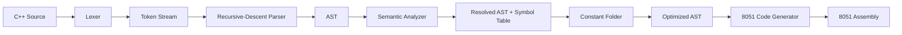

# C++51 Compiler

A browser-based educational compiler that translates a **documented 8-bit subset of C++** into **Intel 8051 assembly**.

The project is intentionally not presented as a full ISO C++ compiler. Its goal is to make the important compiler-engineering stages visible and understandable: lexical analysis, parsing, AST construction, semantic analysis, optimization, memory allocation and target-specific code generation.

## Resume description

> Built a browser-based compiler for a documented 8-bit C++ subset targeting the Intel 8051, implementing lexical analysis, recursive-descent parsing, AST construction, lexical scoping, semantic validation, constant folding, internal-RAM allocation, stack-based expression code generation, diagnostics and automated tests.

## Architecture



### What each phase does

| Phase | Responsibility |
| --- | --- |
| Lexer | Converts characters into tokens with line/column locations |
| Parser | Checks grammar and builds the AST |
| Semantic analyzer | Resolves variables, scopes, ports and loop rules |
| Symbol table | Maps C++ variables to 8051 RAM |
| Optimizer | Constant-folds expressions known at compile time |
| Code generator | Converts AST operations into 8051 instructions |
| UI | Exposes source, tokens, AST, symbols, diagnostics and assembly |
| Tests | Verify valid programs, errors, optimization and generated patterns |

## Project structure

```text
cpp51-compiler/
├── index.html
├── styles.css
├── package.json
├── README.md
├── examples/
│   ├── arithmetic.cpp
│   ├── control-flow.cpp
│   └── demo.cpp
├── src/
│   ├── codegen.js
│   ├── compiler.js
│   ├── errors.js
│   ├── lexer.js
│   ├── optimizer.js
│   ├── parser.js
│   ├── semantic.js
│   └── ui.js
└── tests/
    └── compiler.test.js
```

## Supported C++ subset

The input deliberately resembles ordinary C++, while unsupported language features are rejected instead of being silently miscompiled.

Supported:

- `int main()`
- `uint8_t` variables
- `unsigned char` variables
- mandatory variable initializers
- assignment
- postfix `++` and `--`
- `if` / `else`
- `while`
- `break`
- `continue`
- `return expression;`
- decimal and hexadecimal literals from `0` to `255`
- `true` and `false`
- `+`, `-`, `*`, `/`, `%`
- `&`, `|`, `^`, `~`
- `<<`, `>>`
- `==`, `!=`, `<`, `<=`, `>`, `>=`
- `&&`, `||`, `!`
- direct `P0`, `P1`, `P2`, `P3` access
- `//` and `/* ... */` comments
- preprocessor lines such as `#include <stdint.h>` are ignored

Not supported:

- classes and objects
- pointers and references
- arrays
- templates
- STL
- exceptions
- dynamic allocation
- user-defined functions
- function parameters
- floating point
- signed integer semantics

## 8051 memory model

C++51 uses a deliberately simple memory layout:

```text
00H-2FH    reserved / not allocated by C++51
30H-6FH    user variables (64 bytes)
70H-7FH    expression stack (16 bytes)
80H-FFH    8051 SFR space
```

The code generator emits:

```asm
MOV SP,#06FH
```

The 8051 increments `SP` before a `PUSH`, so the first temporary value is written to `70H`.

## Expression code-generation convention

Every expression leaves its result in accumulator `A`.

For a normal binary expression:

```text
1. Generate left operand -> A
2. PUSH ACC
3. Generate right operand -> A
4. POP B
```

After step 4:

```text
A = right operand
B = left operand
```

The operator-specific code then produces the final result in `A`.

Example for subtraction:

```asm
; A = right, B = left
XCH A,B
CLR C
SUBB A,B
; A = left - right
```

## Important 8051 mappings

| Source operation | Main 8051 instructions |
| --- | --- |
| addition | `ADD A,B` |
| subtraction | `XCH`, `CLR C`, `SUBB` |
| multiplication | `MUL AB` |
| division | `DIV AB` |
| modulo | `DIV AB`, then move `B` to `A` |
| bitwise AND | `ANL A,B` |
| bitwise OR | `ORL A,B` |
| bitwise XOR | `XRL A,B` |
| bitwise NOT | `CPL A` |
| increment | `INC direct` |
| decrement | `DEC direct` |
| comparisons | `CJNE`, carry flag and labels |
| conditions | `JZ`, `JNZ`, `LJMP` |
| loops | labels + conditional branch + `LJMP` |
| temporary values | `PUSH ACC`, `POP B` |

## Variable scopes

Each `{ ... }` block creates a scope.

The semantic analyzer searches from the innermost scope outward. This allows normal shadowing:

```cpp
int main() {
    uint8_t value = 1;

    {
        uint8_t value = 2;
        P1 = value;
    }

    P2 = value;
    return 0;
}
```

The two variables receive different generated symbols and RAM addresses.

## Constant folding

The optimizer evaluates expressions containing only literals.

Input:

```cpp
uint8_t result = 2 + 3 * 4;
```

Optimized AST:

```text
result = 14
```

Generated assembly therefore loads `0EH` directly instead of multiplying and adding at runtime.

## Run the app

Because the browser app uses ES modules, serve the repository through a local HTTP server.

Python:

```bash
python3 -m http.server 8080
```

Then open:

```text
http://localhost:8080
```

On Windows you can use:

```bash
py -m http.server 8080
```

## Run the tests

Node.js 18 or newer is sufficient. There are no npm dependencies.

```bash
npm test
```

The tests cover:

- constant folding
- while-loop generation
- comparisons
- block-scope shadowing
- undeclared variables
- invalid `break`
- hardware-port handling
- short-circuit logical operators
- division-by-zero warnings
- unsupported local `int` declarations

## Example

Input:

```cpp
#include <stdint.h>

int main() {
    uint8_t counter = 0;
    uint8_t limit = 10;

    while (counter < limit) {
        P1 = counter;
        counter++;
    }

    return 0;
}
```

The compiler performs:

```text
characters
   ↓
tokens
   ↓
AST
   ↓
resolved AST + symbol table
   ↓
constant-folded AST
   ↓
8051 assembly
```

## Design choices worth explaining in an interview

### Why a subset instead of full C++?

Full C++ contains a very large grammar, type system, ABI, object model, templates, exceptions and runtime requirements. A carefully documented subset lets this project implement compiler phases correctly instead of pretending that simple text substitution is a C++ compiler.

### Why recursive descent?

The supported grammar is small enough that recursive descent is readable and easy to debug. Operator precedence is visible directly in the parser structure.

### Why attach symbols to AST nodes?

Name lookup happens once during semantic analysis. Code generation can then use resolved symbols directly, which keeps backend logic simpler and separates responsibilities cleanly.

### Why reserve 70H-7FH?

The 8051 hardware stack uses internal RAM. User variables stop at 6FH, and `SP` starts at 6FH, so expression pushes occupy 70H-7FH without overwriting variables.

### Why use the hardware stack for expressions?

Nested expressions need temporary storage. Using `PUSH ACC` / `POP B` creates a simple recursive expression-generation strategy and gives the compiler a measurable maximum stack depth.

## Known limitations

This is an educational compiler backend, not a drop-in replacement for SDCC, Keil C51 or a production C++ toolchain.

The generated assembly intentionally targets a generic 8051-style instruction set and assumes an assembler that recognizes standard SFR names such as `ACC`, `B`, `P0`, `P1`, `P2` and `P3`.

Division by zero is defined by this project to produce zero and emit a compiler warning. That behavior is a project design choice and is not C++ language semantics.

## Suggested resume bullets

- Built a modular C++-subset compiler targeting the Intel 8051 using JavaScript ES modules.
- Implemented a lexer, recursive-descent parser, AST, lexical scopes, symbol resolution and compile-time constant folding.
- Designed an 8051 backend with RAM allocation, stack-based expression evaluation, branch/loop generation and direct SFR access.
- Added an interactive compiler-inspection UI and Node.js automated tests for valid programs, diagnostics and backend behavior.
